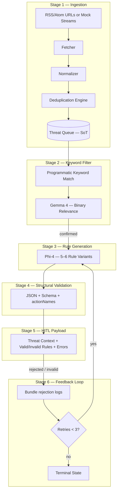
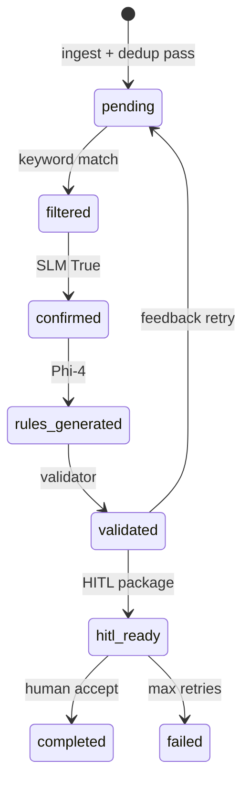
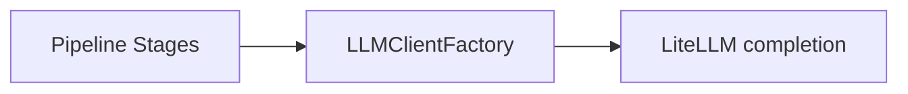

# Threat Research Automation Pipeline — Architecture

## Executive Summary

A modular, model-agnostic Python pipeline that ingests threat intelligence from RSS/Atom feeds (or mock streams), normalizes and deduplicates articles into a **stateful Threat Queue**, filters by keywords with SLM confirmation, generates detection rules via a reasoning model, validates structurally, packages **HITL** payloads, and runs an **automated feedback loop** (max 3 retries).



---

## Design Principles

| Principle | Implementation |
|-----------|----------------|
| **Model agnosticism** | `LLMClientFactory` + LiteLLM; models configured via env/settings, not hard-coded in business logic |
| **Strict contracts** | Pydantic v2 models for queue items, LLM structured outputs, rules, validation results, HITL payloads |
| **Stateful ingestion** | SQLite-backed `ThreatQueue` with dedup cache; optional in-memory mode for tests |
| **Separation of concerns** | `ingestion/`, `filters/`, `generators/`, `validators/`, `llm/`, `hitl/`, `feedback/` |
| **Deterministic validation** | Programmatic validator independent of LLM; failures carry machine-readable error logs |
| **Idempotent dedup** | Content fingerprint (title + URL + normalized body hash); optional near-duplicate via SimHash bucket |

---

## Directory Structure

```
Threat_automation/
├── ARCHITECTURE.md          # This document
├── pyproject.toml
├── requirements.txt
├── main.py                  # CLI orchestration entrypoint
├── config/
│   └── settings.py          # Pydantic Settings (feeds, models, DB path, keywords)
├── data/
│   └── mock_feeds.json      # Mock document stream for offline tests
├── src/threat_pipeline/
│   ├── models/              # All Pydantic domain models
│   ├── ingestion/           # Fetcher, Normalizer, Dedup, ThreatQueue
│   ├── filters/             # Keyword + SLM relevance
│   ├── generators/          # Phi-4 rule variants
│   ├── validators/          # Structural rule validation
│   ├── llm/                 # Client factory + prompts
│   ├── hitl/                # UI payload builder
│   ├── feedback/            # Correction loop (max 3)
│   └── orchestrator.py      # Pipeline coordinator
└── tests/
```

---

## Stage 1 — Comprehensive Ingestion (Threat Queue Generation)

### 1.1 Input Layer

- **RSS/Atom**: List of feed URLs in config or CLI; `Fetcher` uses `feedparser` + `httpx` with timeouts and retries.
- **Mock streams**: JSON array of `{source, title, published_at, url, raw_html|raw_text}` for CI and local dev.

### 1.2 Normalizer Module

**Responsibilities:**

1. Parse feed entries or mock documents.
2. Strip boilerplate: scripts, styles, ads, tracking pixels (BeautifulSoup + blocklist selectors).
3. Emit `NormalizedArticle`: `source`, `title`, `published_at`, `url`, `content_markdown`, `content_plain`, `fetched_at`.

**Metadata contract:** ISO-8601 dates; `source` = feed hostname or explicit label.

### 1.3 Deduplication Engine

| Strategy | Key | Action |
|----------|-----|--------|
| Exact | `SHA256(normalize(title) \| url)` | Drop if seen in `dedup_cache` |
| Near-duplicate (optional) | SimHash of first 2k chars of plain text | Drop if Hamming distance ≤ 3 within bucket |

State persisted in SQLite table `dedup_cache` alongside queue writes (single transaction).

### 1.4 Stateful Threat Queue

- **Role:** Source of truth for all downstream stages.
- **Backing store:** SQLite (`threat_queue.db`) with WAL; in-memory URI for tests.
- **Item states:** `pending` → `filtered` → `confirmed` → `rules_generated` → `validated` → `hitl_ready` → `completed` / `failed`.
- **API:** `enqueue`, `dequeue_next`, `update_status`, `peek_by_id`, `list_pending`.



---

## Stage 2 — Keyword Filter

1. **Dequeue** sequentially from Threat Queue (`status=pending`).
2. **Programmatic check:** case-insensitive substring match against `KEYWORDS` (e.g. `AWS`, `CloudTrail`, `Okta`).
3. **No match:** mark `filtered` + `dropped_reason=keyword_miss`; do not invoke LLM.
4. **Match:** call **Gemma 4** (configurable via `SLM_MODEL`) with structured binary prompt → `RelevanceVerdict(is_threat: bool, rationale: str)`.
5. **False:** drop with `dropped_reason=slm_rejected`.
6. **True:** advance to `confirmed`.

---

## Stage 3 — Rule Generation

- **Model:** Phi-4 (configurable `REASONING_MODEL`).
- **Input:** Normalized article + optional prior validation/human error logs (feedback).
- **Output:** `RuleGenerationBatch` with 5–6 `ThreatRule` variants.

### Rule JSON Schema (exact)

```json
{
  "name": "",
  "description": "",
  "actionNames": [],
  "defaultSeverity": "",
  "threatType": "",
  "recommend": "",
  "remediate": ""
}
```

Allowed `actionNames` (semantic validation): configurable allowlist in `settings.VALID_ACTION_NAMES`.

---

## Stage 4 — Structural Validation

Deterministic suite per variant:

| Check | Failure code |
|-------|----------------|
| Valid JSON parse | `JSON_SYNTAX` |
| Pydantic schema types | `SCHEMA_TYPE` |
| Required non-empty strings | `SCHEMA_REQUIRED` |
| `actionNames` ⊆ allowlist | `ACTION_SEMANTIC` |
| `defaultSeverity` ∈ enum | `SEVERITY_ENUM` |

Each variant → `ValidationResult(status=Valid|Invalid, errors: list[ValidationError])`.

---

## Stage 5 — HITL Interface Data

`HITLPayload` per confirmed threat:

```python
{
  "threat_id": str,
  "threat_context": { title, source, url, published_at, excerpt },
  "validated_rules": list[ThreatRule],      # 2–3 Valid samples
  "invalid_rules": list[{
      "rule": ThreatRule,
      "errors": list[ValidationError]
  }],
  "metadata": { pipeline_version, generated_at }
}
```

Front-end consumes JSON; no UI in scope.

---

## Stage 6 — Automated Feedback Loop

**Triggers:**

- Human rejects a previously **Valid** rule.
- Any **Invalid** rule after validation.

**Behavior:**

1. Bundle `FeedbackBundle(original_context, rejected_rules, error_logs, human_notes?)`.
2. Increment `retry_count` on queue item.
3. If `retry_count < 3`: re-invoke Stage 3 with augmented prompt (errors inlined).
4. Else: `status=failed`, attach terminal error summary.

---

## LLM Integration Layer



- **Interface:** `complete(model, messages, response_format: Type[BaseModel]) -> BaseModel`
- **Swapping models:** change `SLM_MODEL` / `REASONING_MODEL` in `.env`; no code changes in stages.
- **Mock mode:** `LLM_MOCK=true` returns deterministic Pydantic instances for tests.

---

## Data Models (Pydantic)

| Model | Package |
|-------|---------|
| `NormalizedArticle`, `DedupRecord`, `QueueItem` | `models/ingestion.py` |
| `ThreatRule`, `RuleVariant`, `ValidationResult` | `models/rules.py` |
| `RelevanceVerdict`, `RuleGenerationBatch`, `HITLPayload`, `FeedbackBundle` | `models/pipeline.py` |

---

## Configuration

| Variable | Default | Purpose |
|----------|---------|---------|
| `THREAT_QUEUE_DB` | `./data/threat_queue.db` | SQLite path |
| `FEED_URLS` | — | Comma-separated RSS URLs |
| `KEYWORDS` | AWS,CloudTrail,Okta | Filter list |
| `SLM_MODEL` | gemma-2-9b-it | Binary relevance |
| `REASONING_MODEL` | phi-4 | Rule generation |
| `LLM_MOCK` | false | Test without API keys |
| `MAX_FEEDBACK_RETRIES` | 3 | Feedback cap |

---

## Orchestration (`main.py` / `orchestrator.py`)

```
run_ingestion(feeds | mock_path)
run_filter_stage()
run_generation_stage()
run_validation_stage()
build_hitl_payloads()
# Feedback invoked on demand or via CLI flag --feedback
```

Single `PipelineOrchestrator` coordinates stages, injects dependencies (queue, llm factory, settings), and logs structured JSON lines.

---

## Testing Strategy

| Test | Scope |
|------|-------|
| `test_ingestion.py` | Normalizer HTML stripping, metadata |
| `test_dedup.py` | Exact + near-duplicate drops |
| `test_validator.py` | Schema, actionNames, severity |
| `test_pipeline_mock.py` | End-to-end with `LLM_MOCK=true` |

---

## Security & Operations (production notes)

- Feed fetching: TLS verify, timeout, rate limiting per host.
- Secrets via environment only; never commit API keys.
- Queue DB: file permissions `0600`; backup before migrations.
- Observability: structlog with `threat_id`, `stage`, `duration_ms`.
- Horizontal scale: replace SQLite with PostgreSQL + `SELECT ... FOR UPDATE SKIP LOCKED` on dequeue.

---

## Extension Points

1. **Vector near-dedup:** plug embedding store behind `DeduplicationEngine`.
2. **Additional filters:** YARA/Sigma pre-check stage before SLM.
3. **Export:** push Valid rules to SIEM SOAR via webhook adapter.
4. **Multi-tenant:** namespace `threat_id` + per-tenant queue tables.
